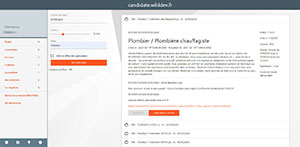
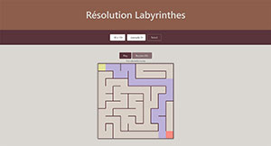
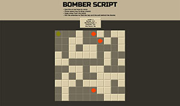
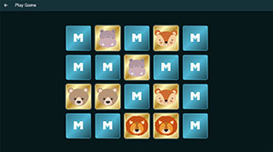

## Bienvenue sur ma page GitHub

**Il est évident que vous n'êtes pas ici par hasard !!**

Alors profitez en pour vous balader sur mes différents projets persos réalisés pendant ma formation au Campus Numérique In The Alps.

### Candidate

Vous pouvez gérer vos candidatures sur : https://candidate.wilddev.fr/

### Labyrinthes

Vous pouvez résoudre des labyrinthes sur : https://bartosnicolas.github.io/Labyrinthe/

### Bomber Script

Vous pouvez bombarder sur : https://bartosnicolas.github.io/BomberScript/

### Memories

Vous pouvez verifier votre mémoire sur : https://bartosnicolas.github.io/memories/

### Mon CV

*Sinon vous pouvez visiter mon CV sur https://bartosnicolas.fr*
