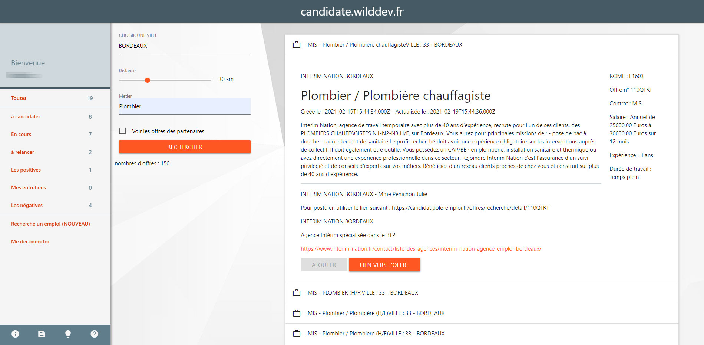
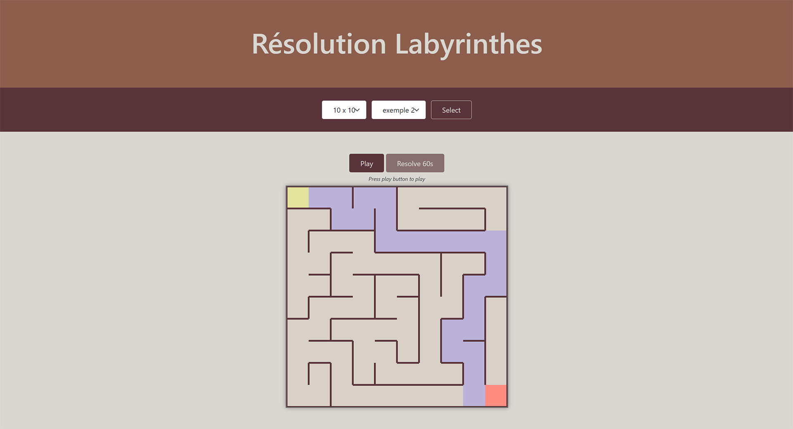
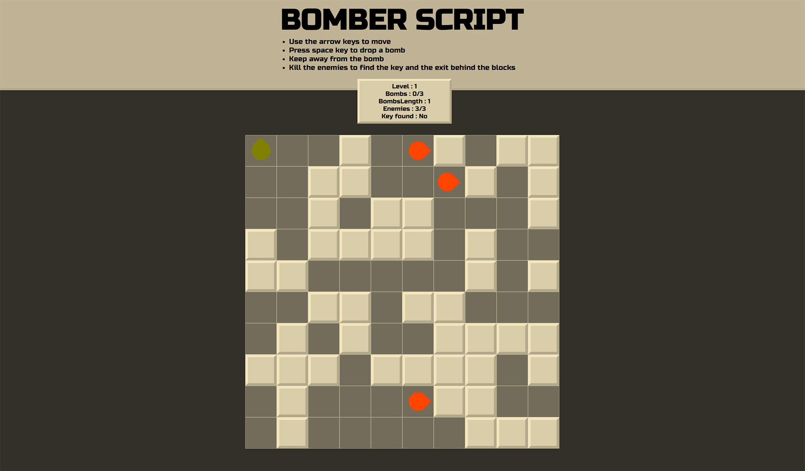
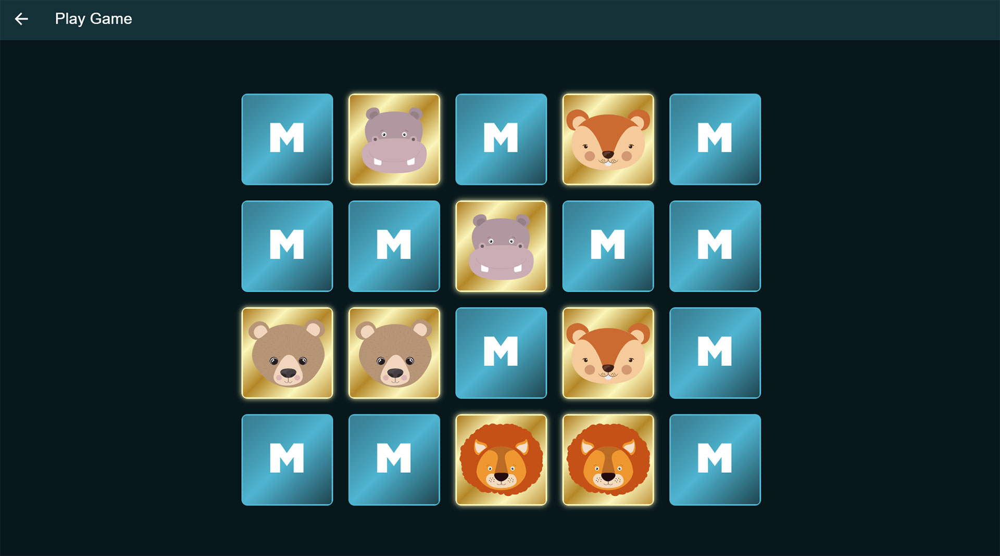

## Bienvenue sur ma page

**Il est évident que vous n'êtes pas ici par hasard !!**

Alors profitez en pour vous balader sur mes différents projets persos réalisés pendant ma formation au Campus Numérique In The Alps.

Sinon visitez mon CV sur [bartosnicolas.fr](https://bartosnicolas.fr)

### Candidate (PHP Laravel)

J'ai réalisé ce projet en PHP avec Laravel afin de pouvoir gérer mes candidatures lors de ma recherche de stage. J'y ai inclus un système d'authentification pour de multiples utilisateurs et aussi l'API de pôle emploi pour faire des recherches directement dans l'application.

Vous pouvez visiter sur : [candidate.wilddev.fr](https://candidate.wilddev.fr/)

### Labyrinthe (JavaScript)

Exercice d'algorithmie en pur javascript (POO) pendant ma formation au Campus Numérique In The Alps.
L'exercice consistait à trouver une algo pouvant résoudre le labyrinthe toute seule. J'y ai rajouté le coté ludique. 
*Cliquez le le H de labyrinthe pour débloquer la résolution sans attendre.*

Vous pouvez le tester sur : [bartosnicolas.github.io/Labyrinthe/](https://bartosnicolas.github.io/Labyrinthe/)

### BomberScript (Vue.js)

Ce projet perso est la réalisation d'un jeu en Vue.js afin de manipuler ce framework qui est surement l'un de mes préférés. Le but est d'exploser les blocks pour trouver la sortie et de détruire les enemis pour trouver la clé ainsi que des différents bonus. Attention de ne pas vous faire coincer.

Vous pouvez vous amuser sur : [bartosnicolas.github.io/BomberScript/](https://bartosnicolas.github.io/BomberScript/)

### Memories (Vue.js/Ionic)

Encore un projet perso qui est un jeu "décidément...". Celui-ci est pour mon fils qui adore ce genre de jeux, j'ai donc décidé de lui en faire un avec Vue.js combiné à Ionic/capacitor pour l'exportation en Mobile. Puis, peut-être qu'avec le temps, je rajouterai des images pour faire différents niveaux et le proposerai sur un store.

Vous pouvez verifier votre mémoire sur : [bartosnicolas.github.io/memories/](https://bartosnicolas.github.io/memories/)

### Les autres projets
Tous les autres projets de ce GitHub sont ceux réalisés pendant ma formation de développeur Web/Applis avec le Campus Numérique In The Apls.

J'ai d'autres projets en cours pour tester certaines fonctionnalités comme un chat avec socket.io, une appli pour contrôler mes lumières via ikea tradfri qui ne sont pas sur ce GitHub.
